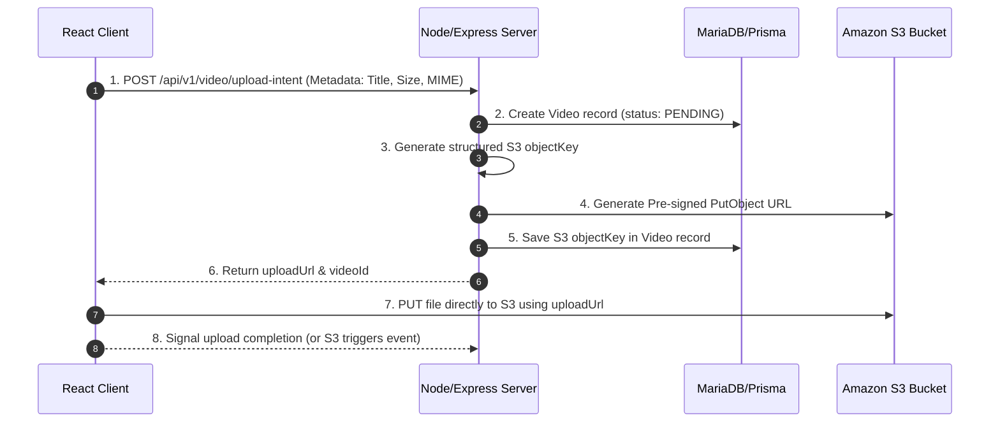
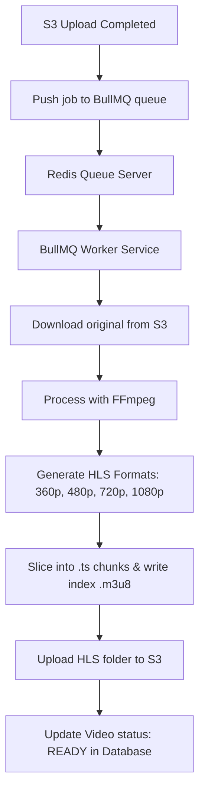

# Project Architecture & Core Features

This document outlines the core architecture and technical features implemented in this Video Processing and Streaming application.

---

## 🔑 1. Production-Grade Authentication Mechanism

The authentication system is built with security, robustness, and state-of-the-art token rotation to keep sessions safe from common web vulnerabilities (XSS, CSRF).

### Key Components

*   **In-Memory Access Tokens (Zustand):**
    The React front-end stores the short-lived JSON Web Token (JWT) access token purely in-memory using a Zustand store. This protects the token from Cross-Site Scripting (XSS) attacks that target browser storage (`LocalStorage` or `SessionStorage`).
*   **HttpOnly Cookie Refresh Tokens:**
    The long-lived refresh token is stored in an `HttpOnly`, `Secure`, and `SameSite=Strict` cookie managed entirely by the server. JavaScript running on the client cannot read or access this cookie.
*   **Atomic Refresh Token Rotation (RTR):**
    To prevent replay attacks and token reuse, every token refresh request rotates the token. The server performs two operations atomically within a database transaction ([Prisma $transaction](file:///d:/Developers/Projects/VideoProcessing/server/src/services/auth.service.ts#L157-L160)):
    1.  Invalidates (deletes) the old refresh token.
    2.  Issues and registers a new refresh token with a new unique JTI (UUID).
*   **Client-Side Request Queueing (Axios Interceptors):**
    If the access token expires while multiple client-side API requests are in-flight, the client interceptor ([apiClient.ts](file:///d:/Developers/Projects/VideoProcessing/client/src/api/apiClient.ts#L50-L121)) blocks and queues subsequent requests. It triggers a single `/auth/refresh` request, updates the Zustand store with the new access token, and retries the queued requests seamlessly.

---

## 📤 2. Direct S3 Uploading via Pre-signed URLs

To ensure high scalability and zero server-side performance bottlenecks during large video uploads, the project implements an **Upload Intent** pattern.

### Key Components

*   **Zero Server Overhead:**
    Large files bypass the Express application server entirely. The client uploads the binary directly to Amazon S3. The application server only handles metadata and URL generation.
*   **Structured S3 Key Space:**
    Objects are systematically structured in the S3 bucket under `videos/${ownerId}/${videoId}/original.${extension}` to ensure strict isolation and organization.
*   **Dynamic Expiry:**
    Pre-signed URLs are valid for a limited window (e.g., 30 minutes), minimizing exposure.

---

## ⚙️ 3. Transcoding & HLS Streaming Pipeline (Upcoming Roadmap)

To support seamless adaptive bitrate streaming across varying network environments, a background transcoding pipeline will convert uploaded videos into HTTP Live Streaming (HLS) formats.

### Key Components

*   **BullMQ & Redis Queue:**
    Transcoding is CPU-heavy and slow. BullMQ manages asynchronous queueing, retries, and job state in Redis, allowing worker processes to scale independently of the API server.
*   **Multi-Resolution FFmpeg Transcoding:**
    Workers spawn FFmpeg processes to compress and transcode videos into multiple target resolutions:
    *   **360p** (Mobile, low bandwidth)
    *   **480p** (Standard quality)
    *   **720p** (HD quality)
    *   **1080p** (Full HD quality)
*   **HLS Segmentation:**
    Instead of playing large raw MP4 files, videos are split into `.ts` chunk files (typically 2-6 seconds each) alongside a `.m3u8` master playlist. The player (e.g., HLS.js or video element) dynamically adjusts stream quality based on client network bandwidth.
